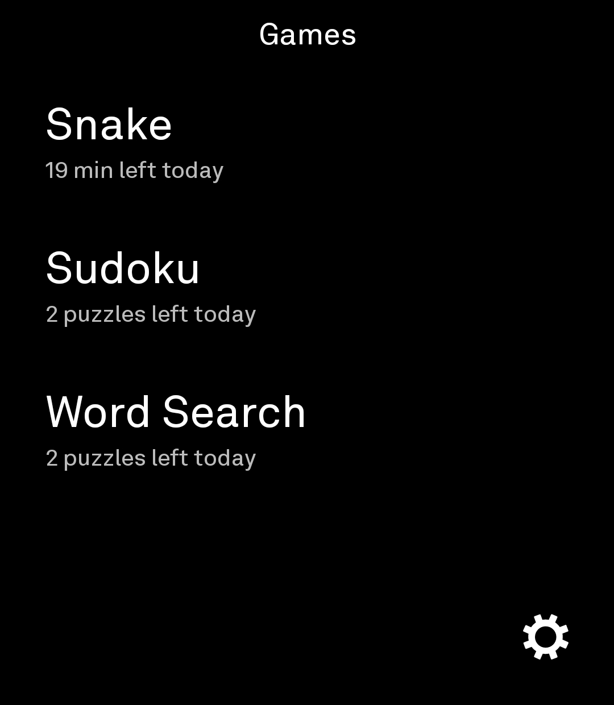
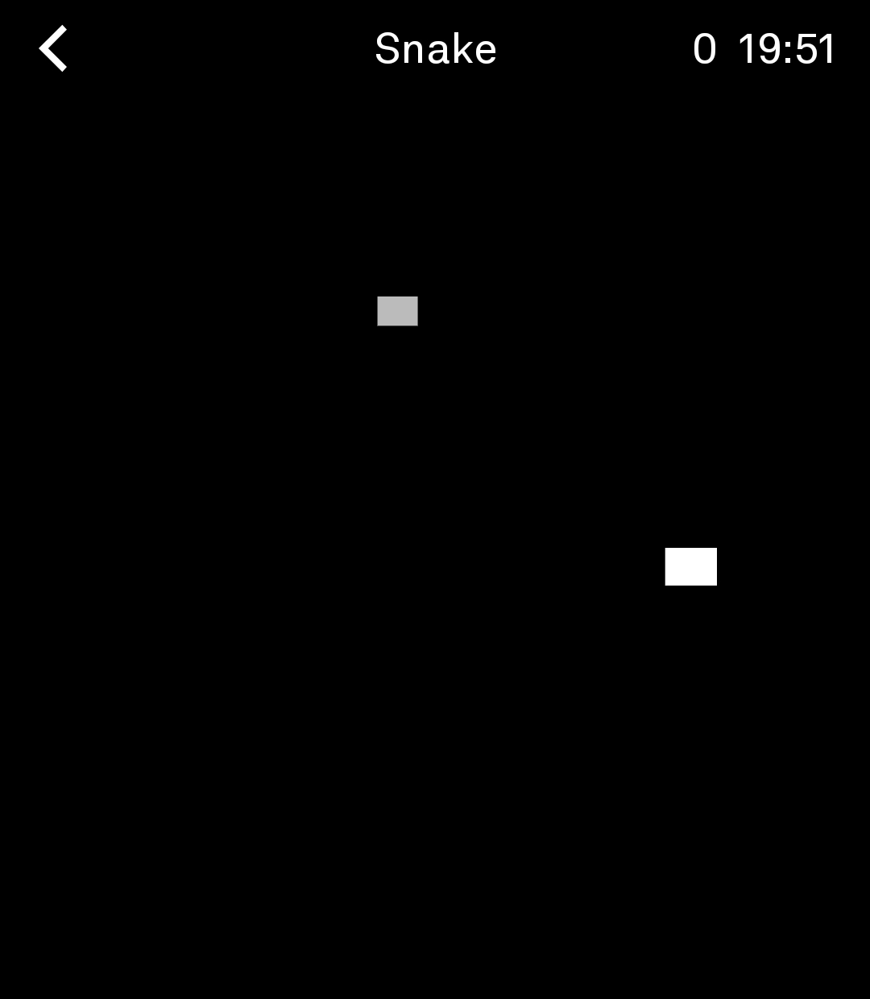
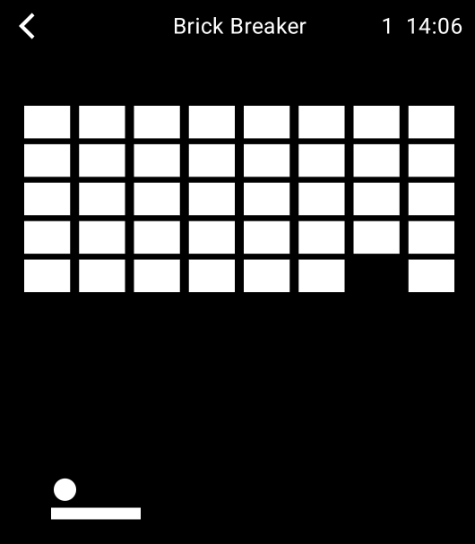
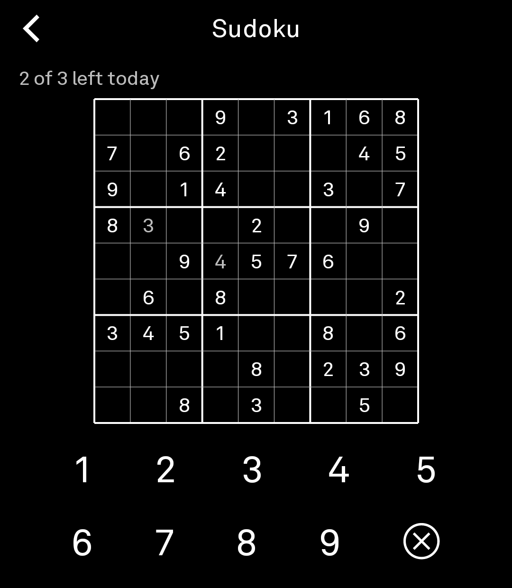
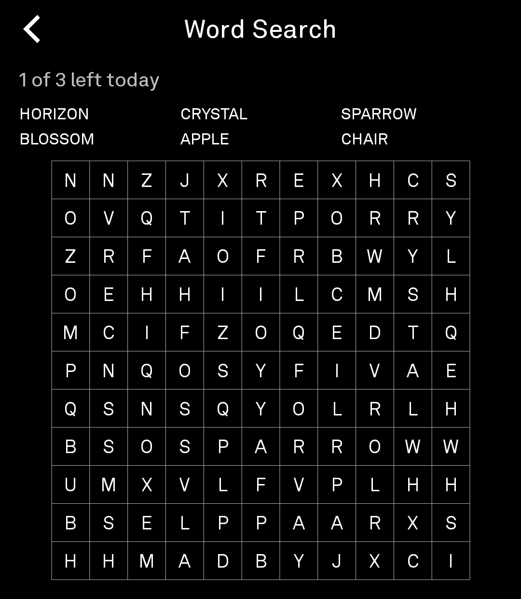

# Games (Light Phone III)

A small games tool for LightOS, built with the Light SDK. Four games: Snake, Brick Breaker, Sudoku, and Word Search.

<p align="center">
  
  
  
  
  
</p>

## What's in it

- **Snake** - swipe to steer. No per-attempt limit, but capped at 20 minutes of playtime per day.
- **Brick Breaker** - tap the left or right half of the screen to nudge the paddle; each tap moves it a fixed distance rather than gliding, for precise control. Shares Snake's 20-minute daily time budget rather than a per-attempt limit, same reasoning: quick rounds, unlimited retries within the budget.
- **Sudoku** - 3 puzzles a day. If you back out mid-puzzle, it resumes right where you left off instead of starting over or costing you another attempt.
- **Word Search** - same daily limit and resume behavior as Sudoku.
- **Settings** - one option right now: invert colors (dark/light).

All progress and daily limits are stored locally on-device. Nothing leaves the phone.

## Installing

Grab the latest APK from this repo's [Releases](../../releases) page and install it directly.

This is self-signed, informal distribution - separate from Light's official Tool Library approval process. If you're using something like Obtainium to track and auto-update from this repo, point it at the repo URL and it'll pick up new releases as they're tagged.

## Building from source

Only needed if you want to modify the code yourself.

Requirements:
- Android Studio
- Android SDK with the API 34/36 platform installed

Steps:
1. Clone this repo.
2. Create a `local.properties` file in the repo root with:
   ```
   sdk.dir=/path/to/your/Android/Sdk
   ```
3. Open the repo root in Android Studio and let Gradle sync.
4. Pick the `tool` run configuration, target an emulator or a Light Phone III in developer mode, and run.

For emulator testing, an AVD around 1080x1240 (API 34, no Google Play Services) is closest to the real device's screen. See `docs/system_app` in this repo if you want to run the actual LightOS emulator shell instead of a plain Android emulator.

## Deviations from the stock SDK

This repo patches a few things in the local `sdk`/`plugin` copies, on top of the actual game code:

- **Custom app icon is wired up.** The stock SDK's manifest generator doesn't reference a launcher icon at all by default; this repo's local `plugin` copy was patched to add `android:icon`/`android:roundIcon`, and the icon itself (an adaptive icon with a Public Sans "G") lives in `tool/src/main/res/`.
- **Splash screen shows only as long as needed.** The SDK's default `LightActivity` enforces a hard ~1 second minimum splash duration; that check was removed from this repo's local `sdk:client` copy, so the splash now shows for exactly as long as it takes content to be ready, nothing more. The splash itself is just a plain black screen with no icon.

## Releasing a new version

Just push to `main` - `.github/workflows/release.yml` builds the APK on every push and publishes it as a rolling `latest` GitHub Release with the APK attached, replacing the previous build:

```
git add .
git commit -m "Your changes"
git push
```

The workflow needs no repo secrets at all - it uses GitHub Actions' automatically-provided token, and doesn't depend on any external private packages.

If you'd rather version releases explicitly instead of always overwriting `latest`, bump `versionCode`/`versionName` in `tool/lighttool.toml` before pushing, and consider switching the workflow to trigger on version tags instead of every push to `main`.
